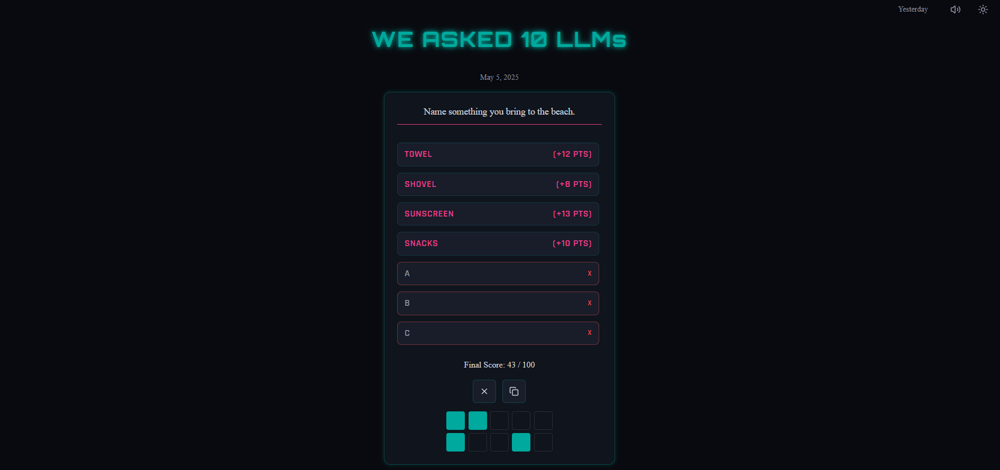

# We Asked 10 LLMs 🧠

A daily guessing game inspired by Family Feud, but powered by LLMs instead of survey responses. Players try to guess the most common answers that multiple large language models gave to a question, earning points based on answer popularity.

This project was entirely vibe coded 🎵✨.



## 🎮 Game Structure

- **Daily Puzzle System**: Questions and answers are generated weekly and served daily
- **LLM Integration**: The game incorporates responses from 10 different language models:
  - GPT-3.5 Turbo
  - Mixtral 8x7B
  - DBRX
  - Llama-3 70B
  - Yi 34B
  - DeepSeek 67B
  - OpenChat 3.5
  - Gemma 7B
  - MythoMax 13B
  - Solar 11B
- **Social Integration**: Players can share their score grid on social media platforms
- **Answer Archive**: Previous day's puzzle answers are available for review

## 🛠️ Technology Stack

### Frontend
- React 18 with TypeScript
- React Router for navigation

### Backend
- Node.js with Express
- TypeScript for type safety
- MongoDB for puzzle storage
- Multiple LLM integrations via Langchain + TogetherAI
- Scheduled jobs for automated puzzle generation

## 🚀 Getting Started

### Prerequisites
- Node.js (v16+)
- MongoDB database
- OpenAI API key (for answer consolidation)
- TogetherAI API key (for multiple LLM access)

### Installation

1. Clone the repository:
   ```bash
   git clone https://github.com/baturyilmaz/weasked10llms.git
   cd weasked10llms
   ```

2. Install dependencies for both frontend and backend:
   ```bash
   # Backend dependencies
   cd backend
   npm install

   # Frontend dependencies
   cd ../frontend
   npm install
   ```

3. Create environment files:
   
   **Backend (.env)**
   ```
   MONGODB_URI=your_mongodb_connection_string
   OPENAI_API_KEY=your_openai_key
   TOGETHER_API_KEY=your_together_api_key
   PORT=3001
   ```

   **Frontend (.env)**
   ```
   VITE_API_URL=http://localhost:3001/api
   ```

4. Start the development servers:
   
   **Backend**
   ```bash
   cd backend
   npm run dev
   ```

   **Frontend**
   ```bash
   cd frontend
   npm run dev
   ```

5. Visit `http://localhost:5173` to view the application.

## 📋 How It Works

1. **Puzzle Generation Process**:
   - Weekly job selects random topics and queries multiple LLMs
   - Basic analysis determines the most common answers
   - OpenAI consolidates semantically similar answers (e.g., "Whitney"/"Whitney Houston")
   - Answers are ranked and assigned point values totaling 100 points

2. **Game Flow**:
   - User gets a limited number of incorrect guesses
   - Correct answers fill the board and award points
   - Game ends when all answers are found or incorrect guesses are exhausted
   - Progress is saved automatically
   - Results can be shared

## 🤝 Contributing

Contributions are welcome! Please feel free to submit a Pull Request.

1. Fork the repository
2. Create your feature branch (`git checkout -b feature/amazing-feature`)
3. Commit your changes (`git commit -m 'Add some amazing feature'`)
4. Push to the branch (`git push origin feature/amazing-feature`)
5. Open a Pull Request

## 📄 License

This project is licensed under the MIT License.

## 🙏 Acknowledgements

- Inspired by the format of Family Feud and Wordle
- Powered by various LLMs from TogetherAI's model collection
- Special thanks to all open-source libraries used in this project 

